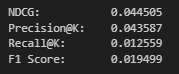
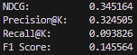

# TheReadingRoom


This Progressive Web App (PWA) provides a dedicated platform for users to share their own book reviews, explore reviews posted by others, and receive book recommendations based on their reading history. The app includes several compelling features designed to enhance user experience and engagement.

## Features

### Book recommendations
- Utilizes the [`recommenders`](https://github.com/recommenders-team/recommenders) package to create a Neural Collaborative Filtering (NCF) recommendation system. This system allows users to receive personalized book recommendations based on their reading history. The `recommenders` package provides a robust framework for building and deploying recommendation systems efficiently.

### Real-Time Chat Functionality
- Utilises `socket.io` for seamless and instant communication among users. This allows participants to engage in discussions and share insights in real time.

### Offline Capability
- Employs a service worker to manage offline functionality. This feature ensures that the app caches relevant files and data, allowing users to access the platform and some of its contents even without an internet connection. Users can post reviews and view previously viewed reviews while offline. This is achieved by utilising IndexedDB to store data while offline and then pushing the data to the database once back online.

### Integration with Google Books API
- Leverages the Google Books API to fetch detailed information about books, including titles, authors, descriptions, and images. This enhances the information available for each book review and aids in the discovery of new books.

### Responsive Web Design
- Easy viewing both on mobile and desktop

## Recommender Systems

The Reading Room employs advanced recommender systems to enhance user experience by providing highly personalized book suggestions. We use collaborative filtering, a method that predicts a user's preferences based on the preferences of other users with similar interests. Specifically, our platform utilizes a Neural Collaborative Filtering (NCF) model, which leverages deep learning to improve recommendation accuracy by capturing the non-linear relationships between users and items.

Compared to the Singular Value Decomposition (SVD) model used as a baseline, the NCF model demonstrated a tenfold improvement in performance. This was evidenced by significantly better evaluation scores, highlighting the effectiveness of incorporating neural network architectures in recommendation systems.

<div align="center">
  
  <br>
  <em>SVD Model Evaluation Results</em>
</div>
<div align="center">
  
  <br>
  <em>NCF Model Evaluation Results</em>
</div>

## General Walkthrough
On this website, a user can register an account and login (the password is hashed before being stored in the database). If they wish to look at reviews posted by others, they can do so by clicking on the relevant review in the table. This will bring them to a new page displaying the review and information about the book. At the bottom is the chat box, where a user can talk to other users viewing the same review, allowing for a discussion about the book. A user can also decide to post their own review. This is done by clicking on the relevant button and filling out the subsequent form. On the user's profile page, the user can recieve a list of recommendations based on their own personal reading history.


## Getting Started

- Download node.js https://nodejs.org 
- Download MongoDB https://www.mongodb.com/try/download/community
- clone the repository and install the necessary dependencies:

```bash
git clone https://github.com/H4mz4k7/TheReadingRoom.git
cd TheReadingRoom
npm install
npm start
```


**Demo videos and photos are available in the "demos" folder.**
